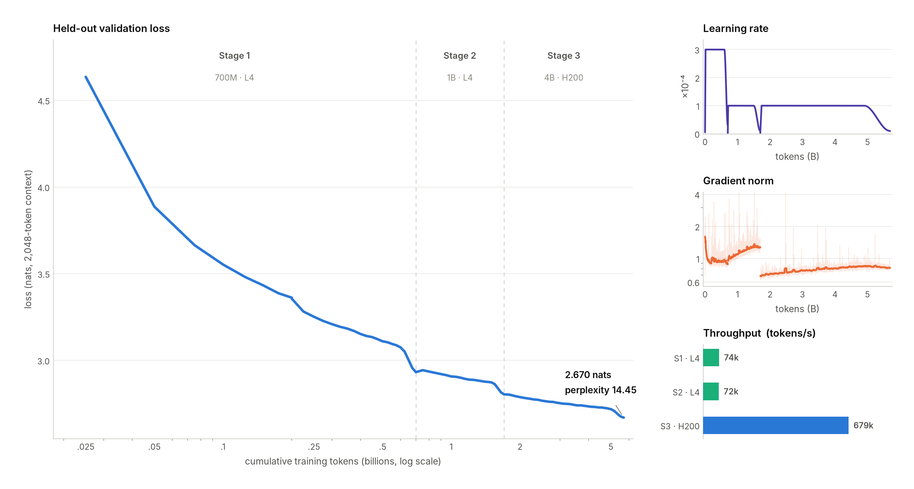

# BarunLM-35M and BarunAction-35M

> **[Read the whole training recipe](https://harrrshall.github.io/barunlm-35m/blog/)** — design rationale, architecture, data, and trade-offs, explained end to end.

## BarunAction-35M candidate-v2 research release

BarunAction-35M is a 35,072,768-parameter, proposal-only compiler that maps a request, explicit
tool schemas, context, and a timezone-aware reference time to strict Action IR JSON. The package
verifies checkpoint hashes, rejects malformed inputs and outputs, never invokes a real tool, and
ships an in-memory-only simulator. It is useful for local research and narrow action compilation;
it is not an autonomous assistant or permission to execute side effects.

The selected float checkpoint achieved 602/756 (79.63%) strict AST exact on a grouped Mobile
Actions development split derived only from public training rows. Its Darwin ARM64/PyTorch
2.13.0/QNNPACK dynamic-int8 artifact passed a frozen retention gate at 607/756 (80.29%), with
755/756 schema-valid outputs, zero generation failures, and zero truncations. The int8 payload is
58.56% smaller than float. These are reused all-`CALL` development results—not the opaque official
Mobile evaluation, a hidden safety test, or evidence of broad function-calling quality.

The independently verified, locally imported Qwen matched baseline scored 663/756 (87.70%) strict
AST exact, compared with candidate-v2's 602/756
(79.63%). The Qwen checkpoint contains 494,032,768 BF16 parameters across 290 tensors—0.494B, not
500B. BarunAction is 14.09 times smaller and retains 90.80% of its exact-match accuracy, but trails
by 61 rows, or 8.07 percentage points. Qwen produced 755 parse-valid and 754 schema-valid outputs;
the paired comparison records 80 Qwen-only wins, 19 Barun-only wins, and 657 ties. The 961 official
rows remained untouched. The hypothesis that candidate-v2 beats a strong larger matched baseline
therefore failed on this development probe. An earlier SmolLM2 result of 0/756 remains
model-and-recipe-specific and cannot support a general larger-model claim. A separate frozen
Mobile-plus-PRESTO rescue also found no joint passer. The exact handoff and next experiment are
documented in `docs/current-status-and-next-experiment.md`.

The candidate-v2 float, Darwin ARM64 int8, and evidence bundles are publicly available as
immutable W&B `v0` artifacts. For example:

```console
uv run --with 'wandb==0.28.1' wandb artifact get \
  --root ./barunaction-35m-candidate-v2-float \
  --type model \
  harshalsingh1223-gladium-ai/barunaction-35m/barunaction-35m-candidate-v2-float:v0
```

The release was independently re-downloaded and all 310 files were hash-verified. See the
[retrieval instructions](docs/barunaction-retrieval.md) for the int8 and evidence identities,
digests, and verification receipts.

```console
uv sync --python 3.11

uv run --python 3.11 barunaction verify \
  --checkpoint PATH/TO/BARUNACTION-FLOAT

uv run --python 3.11 barunaction infer \
  --checkpoint PATH/TO/BARUNACTION-FLOAT \
  --tools examples/barunaction_tools.example.json \
  --context examples/barunaction_empty_context.example.json \
  --now 2026-08-03T20:00:00+05:30 \
  --request "Turn on the flashlight" \
  --device cpu
```

Every successful proposal still returns `execution_permitted: false`. See the
[model card](docs/barunaction-model-card.md), [data card](docs/barunaction-data-card.md),
[retrieval instructions](docs/barunaction-retrieval.md), and
[int8 evidence](docs/int8-quantization.md) before use.

## BarunLM-35M base model

The original BarunLM-35M release reported the strongest score among its evaluated sub-100M base
models under its fixed nine-task protocol. That historical comparison is not a claim over every
model or a current global leaderboard.

BarunLM-35M achieves **41.01%** on a fixed, decontaminated nine-task zero-shot benchmark at **35,072,768 parameters**. It outperforms **LFM2.5-230M-Base** by **1.81 percentage points** while using **6.55× fewer parameters**, leading every evaluated sub-100M base model under the same protocol.



## Overview

BarunLM-35M demonstrates that carefully designed architectures can significantly improve parameter efficiency. Trained on **5.70 billion tokens**, the model surpasses substantially larger language models on a standardized evaluation suite.

The improvement is driven by three core architectural innovations:

* A **3:1 local-to-global attention schedule**
* A **learned residual selector** applied every four layers
* A **capacity-aligned training budget** of **162.5 tokens per parameter**

## Key Highlights

* **Hybrid attention architecture:** Three local-attention layers are followed by one global-attention layer, combining efficient local computation with periodic long-range communication.
* **Selective residual routing:** A lightweight learned residual selector preserves useful representations while improving optimization.
* **Optimized small-model design:** Integrates grouped-query attention, partial RoPE, QK normalization, gated attention outputs, and bounded SwiGLU into a single 35M-parameter architecture.
* **Capacity-aligned pretraining:** Trained on **5.70B tokens** from a curated mixture of educational text, synthetic content, mathematics, general web data, and code.
* **Contamination-aware evaluation:** Benchmark results exclude **1,854 contaminated samples** detected using a correctness-blind 13-token exact-match scan across the complete training corpus.

## Benchmark Results

All models were evaluated **zero-shot** using **LM Evaluation Harness 0.4.12** on:

* ARC-Challenge
* ARC-Easy
* BoolQ
* HellaSwag
* LAMBADA OpenAI
* OpenBookQA
* PIQA
* SciQ
* WinoGrande

| Model            | Parameters | Macro Accuracy | BarunLM Lead |
| ---------------- | ---------: | -------------: | ------------: |
| **BarunLM-35M** |  **35.1M** |     **41.01%** |             — |
| LFM2.5-230M-Base |     229.7M |         39.20% |      +1.81 pp |
| GPT-2 125M       |     125.0M |         39.10% |      +1.91 pp |
| Pythia-160M      |     162.3M |         37.35% |      +3.66 pp |
| Stentor-30M      |      30.4M |         36.46% |      +4.55 pp |
| TinyStories-33M¹ |      68.5M |         33.16% |      +7.85 pp |
| Pythia-70M       |      70.4M |         31.71% |      +9.30 pp |

The paired **10,000-resample bootstrap confidence interval** for the BarunLM minus LFM2.5 difference is **[+0.92, +2.71] percentage points**.

Complete benchmark details, confidence intervals, and task-level scores are available in `benchmark_results.json`.

¹ TinyStories is included as a narrow-domain diagnostic baseline.

## Model Architecture

| Component              | Configuration                   |
| ---------------------- | ------------------------------- |
| Parameters             | 35,072,768                      |
| Layers                 | 12                              |
| Hidden size            | 448                             |
| Attention              | 7 query heads, 1 key/value head |
| Attention schedule     | 3 local layers + 1 global layer |
| Local attention window | 256 tokens                      |
| Position encoding      | 50% Partial RoPE                |
| Feed-forward width     | 1,228                           |
| Residual selector      | Every 4 layers                  |
| Vocabulary             | 16,384 byte-level BPE           |
| Context length         | 2,048 tokens                    |
| Embeddings             | Tied input/output               |

The architecture performs global attention periodically while relying primarily on computationally efficient local attention. This design reduces compute without sacrificing long-range information flow.

## Quick Start

```bash
git clone https://github.com/harrrshall/barunlm-35m.git
cd barunlm-35m

python -m venv .venv
source .venv/bin/activate

pip install -e .

python examples/generate.py \
  --prompt "The future of efficient language models is" \
  --max-new-tokens 48 \
  --temperature 0.8
```

The example automatically downloads the required model artifacts from Hugging Face, verifies SHA-256 hashes, and uses CUDA when available.

For deterministic decoding:

```bash
--temperature 0
```

To download the release manually:

```bash
hf download harrrshall/BarunLM-35M --local-dir BarunLM-35M

sha256sum -c BarunLM-35M/SHA256SUMS
```

## Training

BarunLM-35M was pretrained on **5,699,985,408 tokens** using a sequence length of **2,048**.

The final **4B-token** training stage used:

* Optimizer: Muon
* Peak learning rate: **1e-4**
* Weight decay: **0.1**
* Batch size: **48**
* Training steps: **40,690**
* Hardware: **1× NVIDIA H200**

### Training Data

The training corpus consists of:

* FineWeb-Edu
* Cosmopedia v2
* FineMath-4+
* DCLM-Baseline
* CodeSearchNet Python
* CodeParrot Clean

Documents were deduplicated before training. Training data itself is not redistributed.

## Intended Use

BarunLM-35M is designed for:

* Research on compact language models
* Educational purposes
* Text-generation experiments
* Local prototyping
* Parameter-efficient modeling research

## Limitations

* Base model without instruction tuning
* 2,048-token context window
* Limited factual recall compared to larger models
* English-centric training
* May generate inaccurate, biased, repetitive, or fabricated outputs
* Not intended for medical, legal, financial, or other high-stakes applications without additional safeguards

## Acknowledgements

This project builds upon advances from the open language-model ecosystem, including grouped-query attention, rotary position embeddings, SwiGLU, PyTorch, Hugging Face, LM Evaluation Harness, FineWeb-Edu, Cosmopedia, FineMath, DCLM, CodeSearchNet, and CodeParrot.

## License

The source code and released model weights are licensed under **Apache License 2.0**. Upstream datasets remain subject to their respective licenses and terms.
