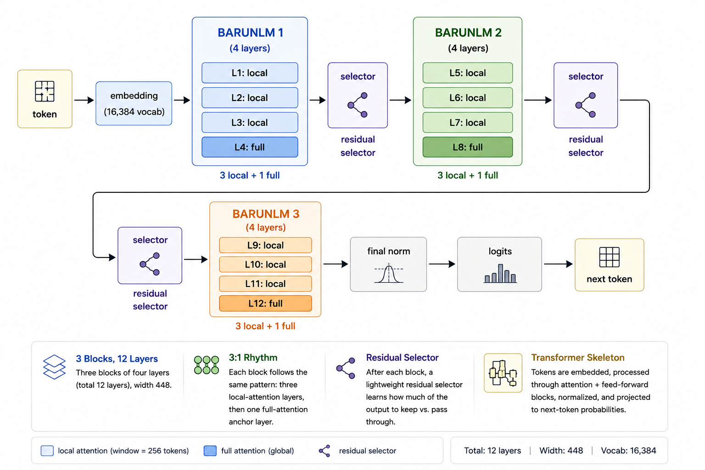

# design of BarunLM

*A design deep-dive into a 35M-parameter architecture. Familiarity with
transformers helps; nothing here requires research background.*

## Why build a 35M model?

BarunLM has **35,072,768 parameters**. It is designed to train on a single
**24 GB GPU** with a **2,048-token context window**. On a frozen nine-task
zero-shot evaluation suite, it achieves **41.01% accuracy**, outperforming
every other sub-100M base model we evaluated under the same protocol. The
paired bootstrap confidence interval for this lead lies entirely above zero,
at **+0.92 to +2.71 percentage points**, indicating a statistically
significant improvement.

These results motivate the central question behind BarunLM: **how much
capability can be extracted from a model with only 35 million parameters?**

At this scale, every parameter matters. There is no room for unnecessary
complexity or architectural indulgence. Every design decision must justify
its cost through measurable gains rather than intuition alone.

The rest of this post explores the engineering decisions that made BarunLM
possible: the architectural ideas that distinguish it, the data and training
recipe that support them, and the trade-offs we intentionally made, as well
as the ones we chose to avoid.

## Architecture overview

BarunLM consists of **12 transformer layers** with a hidden dimension of
**448**, organized into **three blocks of four layers each**. Every block
follows a consistent **3:1 attention pattern**: three local-attention layers
followed by a single full-attention anchor layer. After each block, a
**residual selector** adaptively determines how much of the block's output
should be carried forward.

At its core, the architecture remains a standard autoregressive transformer.
Input tokens are embedded, processed through alternating attention and
feed-forward layers, and finally projected into next-token probabilities.

What makes BarunLM different is not the overall framework, but the refinements
within it. The innovations lie in how attention is structured, how information
flows between blocks, and the design choices that maximize capability while
operating under a strict 35-million-parameter budget.

## Key architectural innovations

### 1. The attention system: a 3:1 local/global rhythm

Attention is where a token decides which other tokens matter to it. barunlm's
central idea is a fixed **3:1 rhythm**: three local-attention layers that each
see a 256-token window, then one full-attention layer that sees the entire
sequence.

Most of what predicts the next token is nearby: syntax, morphology, adjacent
lines of code. Local attention handles that cheaply and at a bounded cache
size. But some things are not nearby. A pronoun refers to a name from the
opening paragraph. An API definition lives much earlier in the file. With
local attention alone, that information degrades through repeated local
compression. The periodic full layer is the guaranteed "zoom out and check the
whole map" moment, a scheduled global information exchange that prevents
local-only information loss by construction.

Three supporting decisions keep the rhythm cheap. **Grouped-query attention**
runs seven query heads against one shared key/value head, cutting the KV cache
7x. **Partial RoPE** rotates only half of each head's channels, keeping
position and content in separate subspaces at zero parameter cost. Two
stabilizers protect BF16 training. **QK-norm** pins query and key scale so
attention doesn't saturate. An **output gate**, a sigmoid projection that
scales the attention result channel by channel, lets a layer decline an
irrelevant update. The gate is the one supporting decision we tested removing.
It was 2.3% faster, but 17.6% worse in perplexity, so it stays.

### 2. Bounded SwiGLU, and why no experts

Feed-forward layers are where most of a transformer's computation happens.
barunlm uses **SwiGLU** instead of a plain MLP: a multiplicative gate that
buys more expressivity per parameter, at width 1,228. The distinctive part is
the **bound**. Gate values are capped above 10, and the linear branch is
clamped to [-10, 10]. BF16 training is wrecked by extreme outlier activations,
so bounding preserves SwiGLU's expressivity while keeping training stable.

We also skipped **Mixture-of-Experts**. MoE routes tokens to subsets of
experts, which at 35M parameters means most weights sit idle behind routes
that never see enough training. A small model can't afford under-used weights.
Dense layers mean every parameter sees every token, every time.

### 3. The residual selector: a learned "skip if unhelpful" path

After each four-layer block, the model RMS-normalizes the block's input
and output, scores both with a tiny linear layer, softmaxes the two scores,
and returns their convex combination. The model literally learns **how much of
each block to keep**. It can bypass a block that didn't help and let the
pre-block representation flow through.

This is a cheap safety valve for depth: a four-layer block is *allowed* to
fail without corrupting the whole stack. It costs 1,344 parameters. Removing
it sped training 5.3% under Muon but worsened perplexity by 1.2%, so it's kept
in the quality reference model and disabled in the fast, slightly-lower-
quality variant.

### 4. The tokenizer

Choosing the tokenizer turned out to be surprisingly important. We train a
**16,384-token byte-level BPE** on the exact pretraining mixture. Byte-level
means code, Unicode, and formulas never hit an unknown token. Small matters
because a large vocabulary would outsize the network at width 448. Input and
output embeddings are **tied**, sharing one table, which saves 7.3M parameters
and regularizes rare tokens.

## Data and training philosophy

A 35M model can't brute-force knowledge with width. It has to learn patterns
efficiently, which makes **data quality the highest-leverage decision in the
project.**

### Capacity-aligned pretraining

Training used **5,699,985,408 tokens**, or roughly **162 tokens for every
parameter**. That ratio is deliberate. Small models are data-hungry: they lack
the capacity to compress broad knowledge, so they need a lot of clean signal
to learn structure. The token budget was matched to the model's capacity. Not
more, which wastes compute. Not less, which underfits.

### The mixture

| Source | Share | What it is | Why it's there |
|---|---|---|---|
| FineWeb-Edu (deduplicated) | 50% | High-quality educational web pages | Broad factual base |
| Cosmopedia v2 | 20% | Synthetic textbook-style text | Repairs web fragmentation; coherent exposition |
| FineMath-4+ | 20% | High-quality math with reasoning chains | Teaches long, step-by-step deduction |
| Documented Python (CodeSearchNet) | 10% | Code paired with docstrings | Formal structure; intent matched to implementation |

### Data synthesis: why generate text you could just scrape?

Web text is fragmented. Prose interleaves with boilerplate, navigation, and
half-finished thoughts. A small model trained on that learns to reproduce the
fragmentation: it starts sentences it doesn't finish.

**Cosmopedia v2 is the antidote.** It's generated by prompting a much larger,
capable model to write complete educational passages: textbooks, stories,
explanations, quizzes, across thousands of topics and reading levels. The
result is text with a beginning, middle, and end.

The reasoning is simple. A small model learns by imitation, so the teacher's
writing quality is a ceiling on the student's. Synthesis lets us manufacture
the coherent signal the web doesn't reliably provide, and tune its content
deliberately instead of accepting whatever the web happens to contain.

### Cleaning before training

Every token gets cleaned before admission: cross-stage deduplication, quality
filtering, document-level held-out hashing so evaluation samples that leak
into training can be detected, and tokenization on the exact mixture. The
reported results excluded 1,854 samples found by a correctness-blind exact
13-token scan over the full training history. The model was evaluated on data
it provably never saw.

### Optimization

We ended up with a hybrid optimizer. **Muon** handles the large weight
matrices, while **AdamW** updates embeddings and normalization parameters. We
evaluated Muon honestly against a full-AdamW run at the same peak learning
rate: it improved perplexity by 0.6% but reduced throughput by 5.0%. So it
stays as the reference optimizer, since the quality gain matters at this
scale, while AdamW remains the practical speed option. The learning rate
follows 5% warmup, an 80% plateau, then 15% cosine decay to 10% of peak.

### The objective: next-token prediction, and the feature we rejected

We kept pretraining deliberately simple: plain **causal next-token
cross-entropy**. The interesting decision is what we tried and removed. An
early candidate added a **multi-token prediction (MTP)** head that also
predicted the token two positions ahead, weighted at 0.2. Removing it improved
perplexity by **3.0%**, throughput by **12.8%**, and peak memory by **11.2%**.
At this scale the extra head was wasted capacity; one clean objective trained
better. MTP pays off at much larger scale, and the philosophy here is that
every technique must earn its keep at 35M parameters, not at someone else's.

### Regularization

Regularization comes from deduplication, tied embeddings, weight decay 0.1,
gradient clipping at 1.0, and bounded activations. **Dropout is zero on
purpose**: the 5.7B-token stream dwarfs the model, so the train/validation gap
is small by construction, and dropout would only slow learning and muddy
throughput. It stays configurable in case a longer run shows a real gap.

## Inference trade-offs

The 3:1 rhythm is a memory strategy as much as a quality one. The honest
headline: it's a *memory* win, not yet a *speed* win.

During generation, a model has to remember previous tokens' keys and values,
the KV cache. GQA already cuts it 7x. Nine of twelve layers retain at most 256
positions. Only the three anchor layers keep full history. At an 8,128-token
prompt, the measured cache is **6.83 MB** versus **24.97 MB** for a dense GQA
baseline, a **3.7x reduction**. That's exactly what long prompts and streaming
inference need on a memory-limited GPU.

The speed side is less flattering. In median-of-three L4 timings, prefill was
6.9% slower and decode 32.8% slower than the dense baseline. The compiled
attention dispatch, the three selector operations, and the output gate all
carry fixed overhead, especially during one-token decode. Weights are BF16 in
research; quantization is deferred until accuracy is established. Closing the
wall-clock gap is ongoing work, and the gate and selector earn their quality
costs, while MTP did not.

We are working on the post-training of this model to make it more useful. Stay tuned for more of these.

*barunlm is open-source (Apache 2.0). Weights, benchmark data, and code:
[huggingface.co/harrrshall/BarunLM-35M](https://huggingface.co/harrrshall/BarunLM-35M) · [benchmark_results.json](../benchmark_results.json)*
